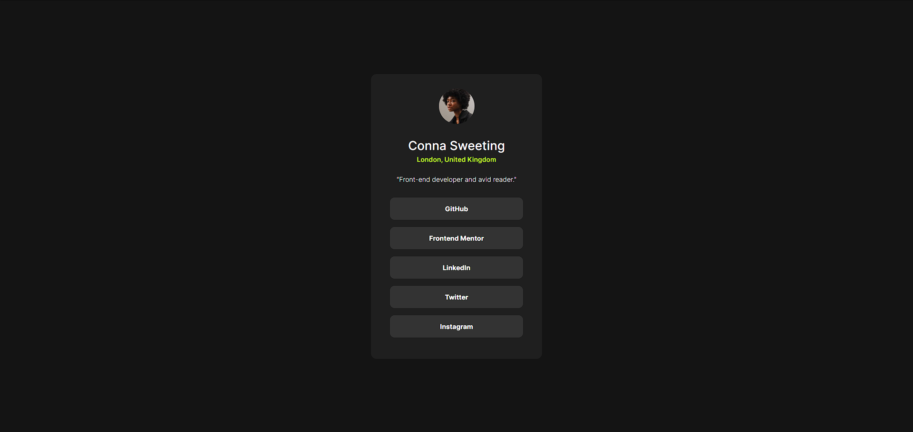

# Frontend Mentor - Social links profile

This is a solution to the [Social links profile challenge on Frontend Mentor](https://www.frontendmentor.io/challenges/social-links-profile-UG32l9m6dQ). Frontend Mentor challenges help you improve your coding skills by building realistic projects.

## Table of contents

- [Overview](#overview)
  - [Screenshot](#screenshot)
  - [Links](#links)
- [My process](#my-process)
  - [Built with](#built-with)
  - [What I learned](#what-i-learned)
  - [Continued development](#continued-development)
  - [Useful resources](#useful-resources)
- [Author](#author)
- [Acknowledgments](#acknowledgments)

**Note: Delete this note and update the table of contents based on what sections you keep.**

## Overview

### Screenshot

### Links

- Live Site URL: [GitHub Pages](https://jordanj03.github.io/social-links-profile)

## My process

### Built with

- HTML5
- CSS3
- Flexbox

### What I learned

This helped solidify some of my basic design skills

## Author

- Jordan Johnston

## Acknowledgements

Thank you to Frontend Mentor for providing me with the idea and resources necessary to build this page :)
